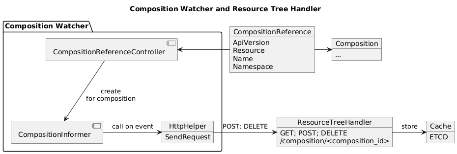

# Resource Tree Handler

This webservice receives GET/POST/DELETE requests from the [Composition Watcher](https://github.com/krateoplatformops/composition-watcher) and acts as a proxy cache for resource trees. When a POST request is made, the webservice stores the respective composition_id and then generates the resource tree. The resource tree is cache for all GET requests until and new one is requested through a POST, or it is deleted through a DELETE. In this last case, if there happens a GET request on a composition id that is not stored in the cache, the webservice returns a "404 Not Found" error. For all other errors, the server returns "500 Internal Server Error".

## Summary

1. [Overview](#overview)
2. [Architecture](#architecture)
3. [API](#api)
4. [Configuration](#configuration)

## Overview

This webservice awaits requests on the endpoint `/composition/<composition_id>` and generates the resource tree for POST requests, returns the resource tree for GET requests, or deletes the resource tree for DELETE requests.

## Architecture

## API

This service exposes one endpoint: 

- `/composition/<composition_id>`

This endpoint can be called with GET, POST or DELETE, with different effects:
- `POST`: the webservice requires a json body with the following format: "internal/webservice/resource_tree.go". Then it generates the resource tree and stores it with the composition_id in the cache;
- `GET`: returns the resource tree associated with composition_id from the cache;
- `DELETE`: deletes the resource tree associated with composition_id from the cache;

## Configuration
This webservice can be installed with the respective [HELM chart](https://github.com/krateoplatformops/resource-tree-handler-alpha-chart).